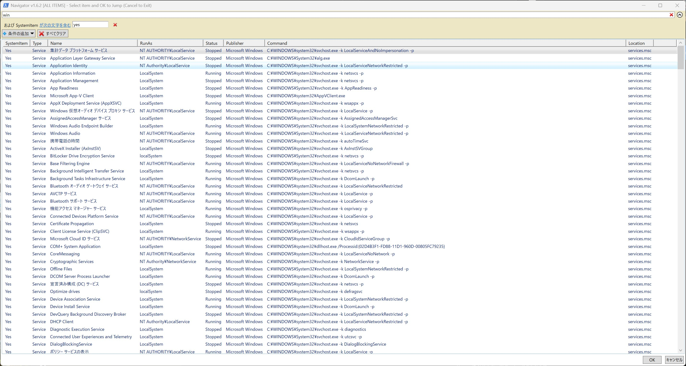

# Mustang AutoExec Navigator v1.6.2

[🚀 Download Latest Release (zip)](https://github.com/MustangTIS/Mustang-AutoExec-Navigator/releases/latest)

Windowsの自動起動項目を一括調査・管理するための、管理者向け軽量ナビゲーションツールです。  
A lightweight, powerful navigation tool for Windows Administrators to audit and manage "Auto-Run" items across the system.

---

## 🚀 Key Features / 主な機能

- **Unified Scan / 横断スキャン**: 
  - サービス、タスク、レジストリ、スタートアップフォルダを1画面で俯瞰。
  - Services, Task Scheduler, Registry (Run keys), and Startup Folders.
- **Execution Context & Publisher / 権限と発行元の可視化**: [NEW]
  - 「どの権限で動いているか」「誰が作ったプログラムか」をひと目で把握。
  - View "RunAs" (SYSTEM/User) and "Publisher" (Digital Signature) at a glance.
- **Noise Reduction / ノイズ除去**: 
  - システム項目を隠し、ユーザーが追加した項目だけに集中。
  - Filter out Microsoft/System items to focus on what matters.
- **Direct Action / 一撃アクション**: 
  - レジストリへの直接ジャンプや、発行元情報を含めた精度の高いGoogle検索。
  - Jump directly to Registry keys or search unknown items on Google using Name + Publisher.
- **Loop Mode / 連続操作**: 
  - 調査が終わるたびに一覧に戻るため、連続チェックがスムーズ。
  - Sequential investigation without re-opening the app.

---

## 🛠 Usage / 使い方

1.  **Run as Admin (Mandatory)**:  
    `AutoRun.bat` を右クリックして**「管理者として実行」**してください。  
    Right-click `AutoRun.bat` and select **"Run as Administrator"**.
2.  **Select Language**:  
    コンソール画面で言語（1:日本語 / 2:英語）を選択します。  
    Choose JP (1) or EN (2) in the console window.
3.  **Choose Mode**:  
    表示モード（1:ユーザー項目のみ / 2:全て表示）を選択します。  
    Filter system items (1) or show everything (2).
4.  **Investigate**:  
    項目を選んで [OK] を押すと、場所が開くか検索が走ります。  
    Select an item from the grid and click [OK] to jump or search.

---

## 💻 Requirements / 動作環境

- Windows 10 / 11 / Windows Server 2016 - 2025
- PowerShell 5.1 or higher
- **Administrator Privileges / 管理者権限**

## 📜 License
This project is licensed under the **MIT License**.
